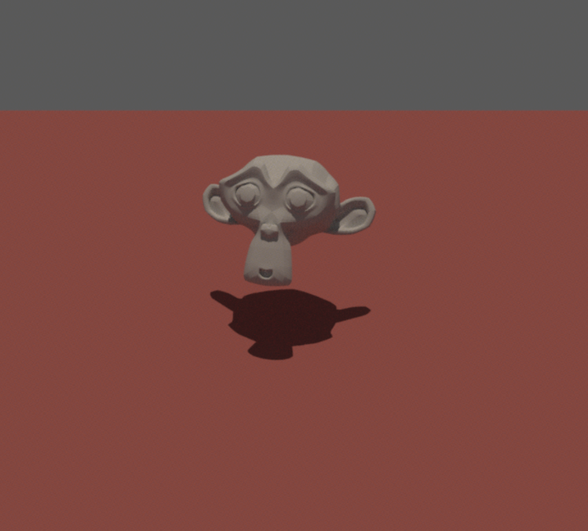
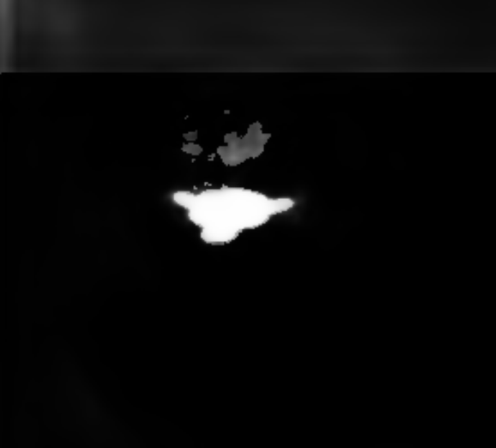
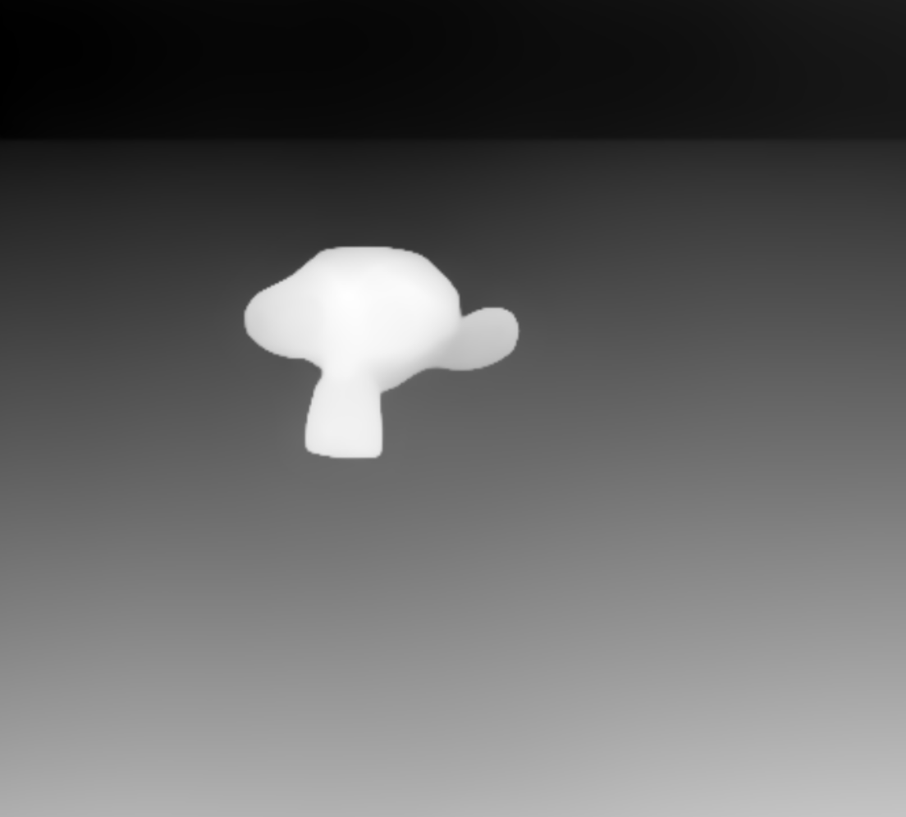

# Light-Position-Estimation-Shadow-Depth-
In this work we evaluate whether incorporating shadow masks and depth maps improves light direction estimation compared to using RGB images only.

1. Synthetic Dataset Synthesis (generate_img.py)
Generates high-fidelity synthetic image datasets with randomized parameters to create generalizable training data.
Core Functionality: Utilizes a custom Python script to orchestrate look-ups, generate random point light locations on a bounded upper hemisphere, apply spatial translations, and execute programmatic rotations around object mesh structures (e.g., Blender Monkey).
Rendering Engine: Interface links directly to a compiled pbrt.exe (Physically Based Rendering) executable. It dynamically generates .pbrt scene files defining camera matrices (perspective, 50° FOV), advanced sampling algorithms (halton with 64 samples per pixel), unified paths, infinite background illumination bounds, and custom geometry materials.

Ground Truth Log: Outputs labels.csv within the structured project dataset directory containing mapped vectors: [filename, light_x, light_y, light_z, monkey_x, monkey_y, monkey_z, rotation_z]. 

The purpose of this synthetic data generation is to calibrate the ground truth ligth direction. We generated the shadow mask, depth map of the RGB image in further steps using the synthetic dataset to apply the dataset on the learning model. 

2. Chrome Sphere Light Calibration (calculate_light_direction.py)
Computes precise 3D direction vectors from real-world photograph configurations where light configurations cannot be programmatically tracked.

Physics & Geometrical Framework: By analyzing reflection highlights on a mirror/chrome reference sphere, the light vector L is strictly derived using the Law of Specular Reflection:

 L= 2(N.V)N -V
                                 

Where N represents the localized surface normal vector and V represents the viewing vector directed toward the camera lens system.

Image-to-World Coordinate Transformations:
The script identifies the maximum specularity coordinates (x_h, y_h) inside the Red Channel (img[:, :, 2]) to avoid clipping from saturated channels.
The pixel distance from the measured sphere center (x_c, y_c) is mapped into a normalized projection space relative to the sphere radius r:

3.Maps vectors into the PBRT Physical Coordinate System where Right is +X, Up is +Z, and Depth is -Y

4. Assuming standard orthographic or long-lens framing constraints, the View Vector is hard-coded down the negative optical axis: $\mathbf{V} = [0 , -1, 0]^T.

Outputs: Automatically outputs annotated verification plots showcasing spatial circle bounds alongside an indexed spreadsheet structure containing labeled outputs (light_directions.xlsx).

3. Multi-Modal Feature Extraction
To enforce strong physical constraints on illumination vector prediction, raw RGB observations are augmented with extracted geometrical and environmental masks.

A. Monocular Depth Estimation (Generate_depth.py)
Core Technology: Integrates the state-of-the-art Depth-Anything-V2 foundation framework (vits encoder architecture).

Execution: Iterates over target sub-directories (img_RGB), applies deep encoder feature forward passes, extracts dense continuous depth profiles, map-normalizes values down to standard grayscale ranges (0-255, uint8), and saves matching targets directly to img_Depth.

B. Shadow Masking & Centroid Extraction (SHADOW_MASKING_.ipynb)
Core Technology: Clones a specialized shadow segmentation framework (ShadowDetection2021) loading pre-trained weights (SBU_model.pth). Includes a built-in hotfix mapping architecture to bypass DenseCRF execution dependencies cleanly via mock bypasses.

Post-Processing & Filtering:Implements Otsu thresholding paired with morphological Open operations (cv2.MORPH_OPEN) to filter out high-frequency noise.Filters pixel noise contours utilizing structured thresholding constraints Area < 50px.Uses Image Moments to calculate spatial shadow centroid coordinates (c_x, c_y)

Outputs: Generates structured dataset logs containing localized centroids and area metadata mappings (shadow_centroids_updated.csv), alongside automated visual evaluation masks.

4. Deep Multi-Modal Training Architecture (Final_training.ipynb)
Integrates all asset streams into a unified regression network capable of generalizing across varied synthetic and physical product categories.

[RGB Input (3ch)] --------> [ Modified ResNet18 ] 
  [Depth Input (1ch)] ------> [ First layer adapted ] ---> [AdaptiveAvgPool] ---> [Fully-Connected Head] ---> [L2 Normalization] ---> Predicted Light Vector (3D)
  [Shadow Input (1ch)] ----- > [  to accept 5ch   ]

  Network Engineering: Modifies a standard backbone ResNet18 model to handle a 5-channel multimodal input tensor: torch.cat([rgb, depth, shadow], dim=1).

The first convolutional layer (conv1) weight matrices are surgically adapted via a custom parameter injection routine: the first 3 channels inherit pre-trained ImageNet weights, while the 2 remaining geometry channels (depth and shadow mask) are instantiated utilizing Kaiming Normal initialization.

Regression Head Design: Employs a dense regression block containing Layer Normalization layers, Dropout layers ($p=0.3$), Rectified Linear Units (ReLU activations), and an $L_2$ vector normalization layer (F.normalize(..., p=2, dim=1)) to enforce unit vector constraints on the predicted 3D coordinate values.

Pipeline Features:Unified Multi-Domain Aggregator: Synchronizes data splits across mixed asset groups consisting of 1,177 samples spanning synthetic classes (monkey, robot, snowman) and real-world targeted captures (flask, cup, handcream, lipstick).Geometrically Aligned Augmentations: Implements cross-channel transforms via torchvision.transforms.functional. If a random horizontal flip is triggered, the model mirrors the RGB image, depth profile, and shadow mask, while simultaneously inverting the target light coordinate $X$-component (L_x = -L_x) to preserve physical space alignment.Robust Training Engine: Evaluates network models utilizing a 5-Fold Cross Validation splitting loop running under AdamW parameter optimization techniques paired with Gradient Clipping boundaries set strictly to 1.0.

Execution & Operational Workflows
Environment Setup
Ensure you have Python 3.10+ installed along with PyTorch (CUDA supported), OpenCV, openpyxl, pandas, and torchvision.

pip install torch torchvision numpy pandas openpyxl opencv-python pillow scikit-learn

Running the Synthetic Renderer
Update PBRT_EXECUTABLE in generate_img.py with your local PBRT system binary path.

Place your reference .pbrt mesh assets into the source root directory.

Execute the data generation loop script:

python generate_img.py

Processing Real-World Targets
Extract illumination vectors from your reference chrome ball images before model training:

python calculate_light_direction.py

Extracting Multi-Modal Features
Run the monocular depth extraction script to generate object geometry masks

python Generate_depth.py

Open and run the SHADOW_MASKING_.ipynb notebook environment to initialize deep shadow segmentation masks.

Training the Unified Model
Open Final_training.ipynb in your development environment (e.g., Google Colab with a GPU runtime) and execute all training blocks. The training loop records cross-validation performance benchmarks across all sub-domains:

Fold 1 | Epoch [12/12] | Overall Train Loss: 0.0040 | Overall Val Loss: 0.0048
   ↳ Val breakdown -> monkey: 0.0138 | robot: 0.0036 | snowman: 0.0025 | flask: 0.0037 | cup: 0.0029 | handcream: 0.0019 | lipstick: 0.0032

  Evaluation & Inference Metrics
The architecture evaluates directional vectors by tracking Angular Error in degrees, calculated as:

Model performance demonstrates high accuracy and domain generalization on held-out data streams:

 IMAGE         | SOURCE FOLDER           | GROUND TRUTH VECTOR (L2-Norm)  | PREDICTED VECTOR (L2-Norm)     | ANGULAR ERROR

 frame_0000.jpg| sample_prediction/RGB   | [-0.8632, 0.0711, 0.4998]      | [-0.8349, 0.0527, 0.5479]      | 3.37°
 frame_0001.jpg| sample_prediction/RGB   | [-0.3303, -0.0022, 0.9439]     | [-0.3510, -0.0393, 0.9355]     | 2.48°
 frame_0004.jpg| sample_prediction/RGB   | [-0.8314, 0.0400, 0.5543]      | [-0.8099, 0.0417, 0.5851]      | 2.16°

